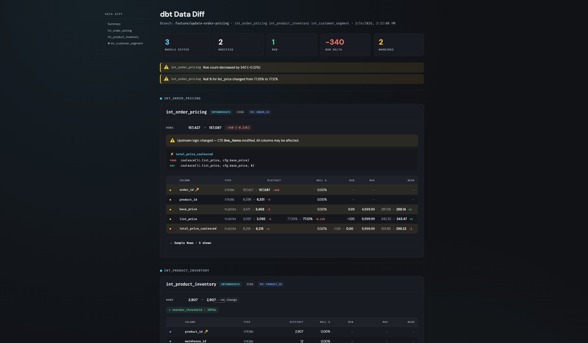

# dbt AI Data Diff

Visual data diff for dbt + BigQuery. Compare production vs development data after model changes — right in your local dev loop or CI.



## Quick Start

```bash
dbt build --select my_model        # 1. Build your changes
./data-diff.sh my_model            # 2. See what changed → opens HTML report
```

Zero configuration — reads your GCP project, dbt project name, and schemas from the manifest automatically.

## Setup

**Python** (3.11+):
```bash
pip install sqlglot
```

**Google Cloud CLI** — needed for `bq` (BigQuery CLI):
```bash
# macOS
brew install google-cloud-sdk

# Or follow https://cloud.google.com/sdk/docs/install

# Authenticate
gcloud auth login
gcloud auth application-default login
```

**jq**:
```bash
# macOS
brew install jq

# Ubuntu/Debian
sudo apt-get install jq
```

## What It Does

Compares your dev tables against production across three layers:

| Layer | What it answers | Cost |
|-------|-----------------|------|
| **Code diff** (sqlglot) | Which SQL expressions and CTEs changed? | Free — local |
| **Schema diff** | Columns added / removed / retyped? | 1 fast query / model |
| **Data diff** (BQ profiling) | Row counts, null %, distinct counts, min/max/mean | 1 query / model / env |

The HTML report includes summary with risk indicators, per-model cards with column profiles (prod vs dev side-by-side), code diffs, and sample rows.

## AI Agent Integration

Includes a `SKILL.md` for [pi](https://github.com/mariozechner/pi-coding-agent) and Claude Code. The agent suggests running data-diff after validation passes and summarises findings in chat.

## CI Integration

See [`examples/ci-example.yml`](examples/ci-example.yml) for GitHub Actions steps. Runs after `dbt build` with `continue-on-error: true` — never blocks PRs.

## Limitations

- **BigQuery only** (v1) — multi-warehouse is a future goal
- **Modified models only** — no downstream profiling yet
- **sqlglot is best-effort** for complex Jinja — falls back to compiled SQL

## License

Apache 2.0
